# Table of Contents

1.  [Introduction to git and github](#org80a6794)
2.  [Setup](#org2306092)
    1.  [Git bash cli](#orga27df6b)
        1.  [Windows](#org2c3f39b)
        2.  [Mac](#orga9019d9)
        3.  [Terminal commands](#orgc31bfe8)
3.  [Repositories](#org283884d)
    1.  [Local Repositories](#orge0dc340)
        1.  [Status](#orgdd7b19f)
        2.  [Adding a file](#org86986ae)
        3.  [Commiting](#org104f195)
        4.  [Edit-add-commit cycle](#org7505c50)
    2.  [Remotes](#orgfd52e2e)
        1.  [Setting up remote authentication](#orgb42d0ea)
        2.  [Creating a remote repository](#orgf8d7194)
        3.  [Getting changes from a remote repository](#orgfed59e8)

# Introduction to git and github

We will be using git and github for the course, both to build the course documents as well as to collaborate on the course exercises. Thus, learning these tools is vital to your success in this course, and these skill sets are going to be increasingly important in regional analysis and policy circles over time.

# Setup

## Git bash cli

We will rely on the command line interface (CLI) to work with git. While this may
seem arcane at first, relative to a more famililar point-and-click interface,
using the command line will have major payoffs for the initial investment. The
key benefits of the cli over a graphical client are:

-   efficiency
-   flexibility
-   portability

We are going to use git-bash as our CLI client on Windows. We then will setup a cli
for Mac after configuring Windows. 

### Windows

1.  Configuration

    We follow instructions from the
    [Git book](https://git-scm.com/book/en/v2/Getting-Started-First-Time-Git-Setup)
    
    1.  Start git bash
    
        
        
        This should open up the console with a git bash shell:
        
        
    
    2.  git user config file is:
    
        `C:\Users\$USER\.gitconfig`
        
        where `$USER` is the user name (i.e., serge)
    
    3.  In git bash:
    
            serge@DESKTOP-FA80SDI MINGW64 ~
            $ cat .gitconfig
            [user]
                    name = Serge Rey
                    email = sjsrey@gmail.com
        
        This was after I setup my config with:
        
            $ git config --global user.name "Serge Rey"
            $ git config --global user.email sjsrey@gmail.com
    
    4.  Editor: Notepad ++
    
        [download and install 32-bit version](https://notepad-plus-plus.org/)
        used only for git commit messages
        
        Setup for git commit messages:
        
            git config --global core.editor "'C:/Program Files (x86)/Notepad++/notepad++.exe' -multiInst -nosession"
        
        After this check, check your settings:
        
            $ pwd
            /c/Users/serge/
            
            serge@DESKTOP-FA80SDI MINGW64 ~
            $ cat .gitconfig
            [user]
                    name = Serge Rey
                    email = sjsrey@gmail.com
            [core]
                    editor = 'C:/Program Files (x86)/Notepad++/notepad++.exe' -multiInst -nosession
            
            serge@DESKTOP-FA80SDI MINGW64 ~
        
        Or use git itself to check specific settings:
        
            serge@DESKTOP-FA80SDI MINGW64 ~
            $ git config user.name
            Serge Rey
            
            serge@DESKTOP-FA80SDI MINGW64 ~
            $ git config user.email
            sjsrey@gmail.com

### Mac

1.  Configuration
    1.  Start Mac CLI:
        [Terminal app](https://support.apple.com/guide/terminal/welcome/mac)
        
        
        
        This should open up the console with a git bash shell:
        
        
    
    2.  git user config file is:
        
        `/Users/$USER/.gitconfig`
        
        where `$USER` is the user name (i.e., weikang)
    
    3.  In git bash:
        
            weikangs-MBP:~ weikang
            $ cat .gitconfig
            [user]
                    name = weikang9009
                    email = weikang9009@gmail.com
        
        This was after I setup my config with:
        
            $ git config --global user.name "weikang9009"
            $ git config --global user.email weikang9009@gmail.com
    
    4.  Editor for git commit messages: Visual Studio (VS) Code
        
        (You can also use other editors like [atom](https://flight-manual.atom.io/using-atom/sections/version-control-in-atom/))
        
        1.  [download and install VS Code on macOS](https://code.visualstudio.com/Download)
        
        2.  Enable VS Code to run from the terminal by typing 'code':
            
            1.  Launch VS Code.
            
            2.  Open the Command Palette (`Shift+Command+P`) and type 'shell
                command' to find the Shell Command: Install 'code' command
                in PATH command.
            
            
            
            1.  Restart the terminal for the new $PATH value to take effect.
                You'll be able to type `code .` in any folder to start
                editing files in that folder.
        
        3.  Setup for git commit messages in the terminal:
            
            $ git config &#x2013;global core.editor "code &#x2013;wait"
        
        4.  After this check, check your settings:
            
                $ pwd
                /Users/weikang
                
                $ cat .gitconfig
                [user]
                        name = weikang9009
                        email = weikang9009@gmail.com
                [core]
                        editor = code --wait

### Terminal commands

Once we have the command line client setup, we are at a bash prompt on either
Windows or Mac, and the commands will all be the same (with the exception of
the editor if we are using one to create the git commit messages-more below).

Some common bash commands to become familiar with include:

1.  finding out current directory: `pwd`

        serge@DESKTOP-FA80SDI MINGW64 ~
        $ pwd
        /c/Users/serge/
        
        serge@DESKTOP-FA80SDI MINGW64 ~

2.  listing contents of current director: `ls`

        serge@DESKTOP-FA80SDI MINGW64 ~
        $ ls
        '3D Objects'/
         Anaconda3/
         AppData/
        'Application Data'@
         Contacts/
         Cookies@
         Desktop/
         Documents/
         Downloads/
         Dropbox/
         Favorites/
         Links/
        'Local Settings'@
         MicrosoftEdgeBackups/
         Music/
        'My Documents'@
         NetHood@

3.  moving to a directory: `cd`

        serge@DESKTOP-FA80SDI MINGW64 ~
        $ cd Documents/
        
        serge@DESKTOP-FA80SDI MINGW64 /c/Users/serge/Documents
        $ pwd
        /c/Users/serge/Documents
        
        serge@DESKTOP-FA80SDI MINGW64 /c/Users/serge/Documents
    
    Note that `cd` without an argument will take you back to your home directory.
    
    Also note that `clear` will clear the terminal.

4.  making a directory: `mkdir`

    We will create a directory for our course work.
    
        serge@DESKTOP-FA80SDI MINGW64 /c/Users/serge/Documents
        $ mkdir courses
        
        serge@DESKTOP-FA80SDI MINGW64 /c/Users/serge/Documents
        $ ls
         ArcGIS/                                       courses/       'My Videos'@
        'ArcGIS 10.5.1'/                               desktop.ini     p/
        'ArcGIS Pro 2.2'/                             'My Music'@
         ArcGISDesktopAdvanced_SingleUse_690779.prvc  'My Pictures'@
        
        serge@DESKTOP-FA80SDI MINGW64 /c/Users/serge/Documents
        $ cd courses
        
        serge@DESKTOP-FA80SDI MINGW64 /c/Users/serge/Documents/courses
        $ pwd
        /c/Users/serge/Documents/courses
        
        serge@DESKTOP-FA80SDI MINGW64 /c/Users/serge/Documents/courses
        $ mkdir pbpl204w19
        
        serge@DESKTOP-FA80SDI MINGW64 /c/Users/serge/Documents/courses
        $ ls
        pbpl204w19/
        
        serge@DESKTOP-FA80SDI MINGW64 /c/Users/serge/Documents/courses
        $

5.  Shell tips

    There are a number of handy features in the shell that can save us time.
    
    1.  History
    
        Using the up arrow key, we can recall the history of things we have done to
        recall a command we want to repeat (or edit). Each time we up-arrow we go back
        in the history one step. If you are on the command you want, you can hit
        `Enter` to execute that command. If you overshoot with the up arrow key, use
        the down arrow key to go in the other direction.
        
        You can also use the `history` command to get a listing of what you have done:
        
             242  cd git_tutorial/
              243  ls
              244  git status
              245  git remote -v
              246  git pull origin master
              247  ssh -v snuc
              248  emacs -nw
              249  exit
              250  pwd
              251  ls
              252  clear
              253  ls
              254  cd Documents/
              255  pwd
              256  ls
              257  cd courses/
              258  ls
              259  rmdir -f pbpl204s19/
              260  rm -f pbpl204s19/
              261  rm -fr pbpl204s19/
              262  ls
              263  clear
              264  cd ..
              265  clear
              266  rm -rf courses
              267  clear
              268  ls
              269  mkdir courses/pbpl204s19
              270  clear
              271  mkdir courses
              272  ls
              273  cd courses
              274  pwd
              275  mkdir pbpl204w19
              276  ls
              277  history
            
            serge@DESKTOP-FA80SDI MINGW64 /c/Users/serge/Documents/courses
            $
        
        So `history` was the last thing I did. If I want to use `pwd`, for example, I
        can use `!274` and `Enter` to repeat the command:
        
              274  pwd
              275  mkdir pbpl204w19
              276  ls
              277  history
            
            serge@DESKTOP-FA80SDI MINGW64 /c/Users/serge/Documents/courses
            $ !274
            pwd
            /c/Users/serge/Documents/courses
            
            serge@DESKTOP-FA80SDI MINGW64 /c/Users/serge/Documents/courses
            $
    
    2.  Tab completion
    
        We can also make use of the `Tab` key to save us some typing. We have
        previously created the directory `pbpl204w19` but haven't yet changed into it
        as we are currently in its parent folder. We could get into that directory
        using `cd pbpl204w19` but that is too much typing. Instead use `cd pb<TAB>`
        where `<TAB>` means use the tab key to complete the typing:
        
            serge@DESKTOP-FA80SDI MINGW64 /c/Users/serge/Documents/courses
            $ cd pbpl204w19/
        
        Then `Enter`:
        
            $ cd pbpl204w19/
            
            serge@DESKTOP-FA80SDI MINGW64 /c/Users/serge/Documents/courses/pbpl204w19
            $ pwd
            /c/Users/serge/Documents/courses/pbpl204w19
            
            serge@DESKTOP-FA80SDI MINGW64 /c/Users/serge/Documents/courses/pbpl204w19
            $

# Repositories

Repositories are
where the files for our project will reside, and where git keeps track of the
history of all files in the project. There are two types of repositories, local
and remote. Local repositories reside on your laptop or desktop machine, while
remote repositories generally reside in the "cloud". We start with creating a
local repository where you will do most of your work. 

## Local Repositories

Next we will set up a git repository in our new directory. Repositories are
where the files for our project will reside, and where git keeps track of the
history of all files in the project.

Let us create a new directory for our project (good practice is to have one git
repository for each project, rather than one repository to hold many projects).

    serge@DESKTOP-FA80SDI MINGW64 /c/Users/serge/Documents/courses/pbpl204w19
    $ mkdir gittutorial
    
    serge@DESKTOP-FA80SDI MINGW64 /c/Users/serge/Documents/courses/pbpl204w19
    $ cd gittutorial/
    
    serge@DESKTOP-FA80SDI MINGW64 /c/Users/serge/Documents/courses/pbpl204w19/gittutorial

So far we have a new directory, but not a respository. We will initialize the
repository with `git init`

    serge@DESKTOP-FA80SDI MINGW64 /c/Users/serge/Documents/courses/pbpl204w19/gittutorial
    $ git init
    Initialized empty Git repository in C:/Users/serge/Documents/courses/pbpl204w19/gittutorial/.git/

The directory `.git` is where all the bookkeeping is done by git. We need not
go in there, but it is good to know what it is.

### Status

Anytime we want to see what the status of our repository is we use `git status`:

    $ git status
    On branch master
    
    No commits yet
    
    nothing to commit (create/copy files and use "git add" to track)

This tells us we are on the `branch` called `master`. More on branches later,
but for now, you can think of a branch as a version of the project repository.

The other output from the `status` command is that we have nothing to commit so
we may want to add files to our project.

### Adding a file

First we need to create a file, then add it to the repository.

Open up `spyder` and create a file *in this directory* called `README.md`.

Then edit the file to have the first line be:

    # Git and github tutorial
    
    Notes on using git and github for PBPL204

so that your editor should look something like:

Now that file is a simple text file that uses [Markdown](<https://github.com/adam-p/markdown-here/wiki/Markdown-Cheatsheet>) syntax that is
rendered on github nicely (and used to build webpages everywhere).

If we check the status of our repository now:

    $ git status
    On branch master
    
    No commits yet
    
    Untracked files:
      (use "git add <file>..." to include in what will be committed)
    
            README.md
    
    nothing added to commit but untracked files present (use "git add" to track)

we see that the new file `README.md` shows up under *Untracked files*. This
means it is not tracked by the repository, but rather is in the folder where
the other files in our repository reside. 

We can add the file to our repository with `git add`:

    serge@DESKTOP-FA80SDI MINGW64 /c/Users/serge/Documents/courses/pbpl204w19/gittutorial (master)
    $ git add README.md
    
    serge@DESKTOP-FA80SDI MINGW64 /c/Users/serge/Documents/courses/pbpl204w19/gittutorial (master)

Now check the status again:

    $ git status
    On branch master
    
    No commits yet
    
    Changes to be committed:
      (use "git rm --cached <file>..." to unstage)
    
            new file:   README.md
    
    
    serge@DESKTOP-FA80SDI MINGW64 /c/Users/serge/Documents/courses/pbpl204w19/gittutorial (master)

and we see the file `README.md` has changes that can be committed. This means
the file is now being tracked by git (since we just added it).
Technically speaking, the file has been *stagged* and is ready for *commiting*.
The stagging area holds changes we have made to a file in the respository, but
those changes have not yet been commited to the repository.
The stage allows us to make a bunch of changes to a file before we do a commit.

### Commiting

We now are in a position to commit our changes in the file to the respository.
We use `git commit` for this:

    serge@DESKTOP-FA80SDI MINGW64 /c/Users/serge/Documents/courses/pbpl204w19/gittutorial (master)
    $ git commit

which should bring up Notepadd++ that we configured above to edit our commit
message. Below the lines beginning with `#` add a commit message so your editor
looks like:

Save the file (`<CTRL-s>`) and quit notepad++ and you should see:

    serge@DESKTOP-FA80SDI MINGW64 /c/Users/serge/Documents/courses/pbpl204w19/gittutorial (master)
    $ git commit
    [master (root-commit) 9440660] My first commit.
     1 file changed, 3 insertions(+)
     create mode 100644 README.md
    
    serge@DESKTOP-FA80SDI MINGW64 /c/Users/serge/Documents/courses/pbpl204w19/gittutorial (master)
    $

Recheck the status of the repository:

    serge@DESKTOP-FA80SDI MINGW64 /c/Users/serge/Documents/courses/pbpl204w19/gittutorial (master)
    $ git status
    On branch master
    nothing to commit, working tree clean
    
    serge@DESKTOP-FA80SDI MINGW64 /c/Users/serge/Documents/courses/pbpl204w19/gittutorial (master)
    $

So we have nothing to commit, and our working tree is clean. All good.

We can get a look at what git knows about our respository using `git log`:

    $ git log
    commit 94406606f5b2f20a0abf290a0b916308aa4ac0e2 (HEAD -> master)
    Author: Serge Rey <sjsrey@gmail.com>
    Date:   Tue Apr 23 10:14:29 2019 -0700
    
        My first commit.
    
    serge@DESKTOP-FA80SDI MINGW64 /c/Users/serge/Documents/courses/pbpl204w19/gittutorial (master)
    $

Note that our commit message `My first commit` shows up in the log. So it is
good practice to write meaningful commit messages as they can help you remember
the purpose of the changes you made at that point in the project.

### Edit-add-commit cycle

Now that we have the file `README.md` under version control we can continue on
working on the project and getting use to the general workflow.

Continue to edit the file in `spyder`, adding the two additional lines:

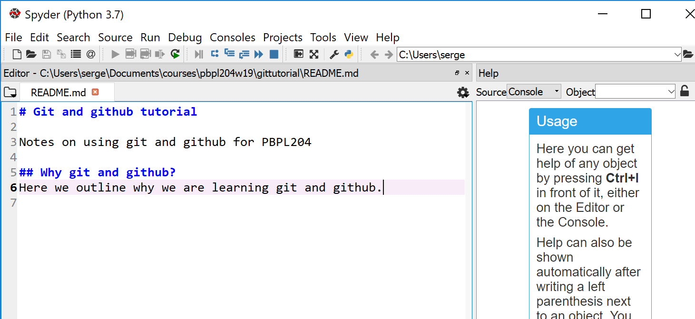
and save. Then check the status of our repository:

    serge@DESKTOP-FA80SDI MINGW64 /c/Users/serge/Documents/courses/pbpl204w19/gittutorial (master)
    $ git status
    On branch master
    Changes not staged for commit:
      (use "git add <file>..." to update what will be committed)
      (use "git checkout -- <file>..." to discard changes in working directory)
    
            modified:   README.md
    
    no changes added to commit (use "git add" and/or "git commit -a")
    
    serge@DESKTOP-FA80SDI MINGW64 /c/Users/serge/Documents/courses/pbpl204w19/gittutorial (master)

Our file has been modified by the edits we just made. These changes have not
yet been stagged or committed to the repository. This is ok as we might want to
continue making changes, we don't have to immediately stage all changes - we
can accumulate a bunch related to one task/section and then add.

For now let's stage these with `git add`:

    serge@DESKTOP-FA80SDI MINGW64 /c/Users/serge/Documents/courses/pbpl204w19/gittutorial (master)
    $ git add README.md
    
    serge@DESKTOP-FA80SDI MINGW64 /c/Users/serge/Documents/courses/pbpl204w19/gittutorial (master)

and check the status

    $ git status
    On branch master
    Changes to be committed:
      (use "git reset HEAD <file>..." to unstage)
    
            modified:   README.md
    
    
    serge@DESKTOP-FA80SDI MINGW64 /c/Users/serge/Documents/courses/pbpl204w19/gittutorial (master)
    $

so now the file is stagged, but not committed. 

We can now commit the changes, but we will do so in a way that shorcuts adding
the commit message without having to use Notepad++. We do this with:

    $ git commit -m 'More edits to README.md'
    [master 27388d9] More edits to README.md
     1 file changed, 3 insertions(+)
    
    serge@DESKTOP-FA80SDI MINGW64 /c/Users/serge/Documents/courses/pbpl204w19/gittutorial (master)
    $

The `-m` flag tells git what follows between the single pair of `` ` `` characters
is our commit message. So no need for firing up an editor to get the commit
message added.

And, we can always check the log to see our history:

    $ git log
    commit 27388d99e35ab4188794ec18cc3ea59f5c0d3fd7 (HEAD -> master)
    Author: Serge Rey <sjsrey@gmail.com>
    Date:   Tue Apr 23 10:58:21 2019 -0700
    
        More edits to README.md
    
    commit 94406606f5b2f20a0abf290a0b916308aa4ac0e2
    Author: Serge Rey <sjsrey@gmail.com>
    Date:   Tue Apr 23 10:14:29 2019 -0700
    
        My first commit.

## Remotes

Remote respositories enable the distributed and social aspects of development
with git. Knowing how to interact with, create, and use remote repositories
will bring us many benefits:

-   remote backups (for free)
-   support collaboration
-   get our work discovered (if we want to)
-   help us discover other great projects

In order to tap into these benefits we have to first understand how to setup
authentication with our github account.

### Setting up remote authentication

Most remote git repositories rely on public key authentication and ssh for
authentication of users. 

Our first step is to create our ssh keys.

1.  Creating ssh keys

    We can follow the git book instructions for doing this:
    [ssh keys](https://git-scm.com/book/en/v2/Git-on-the-Server-Generating-Your-SSH-Public-Key#_generate_ssh_key)
    
    Make sure you remember your passphrase as we will be using it later on.

2.  Getting our key up to github

    We now have our local key-pair, and we have to get a copy of our public key up
    to our github account.
    
    Go to your github account and in the upper right under your avatar click the
    drop down and go to `Settings`. From there select
    
    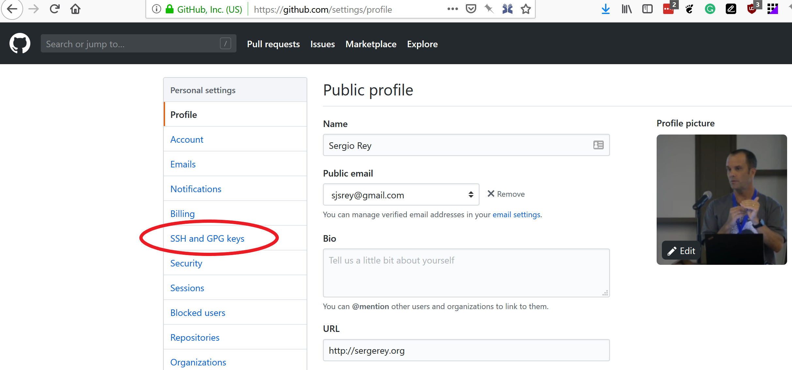
    
    This will open up a new page:
    
    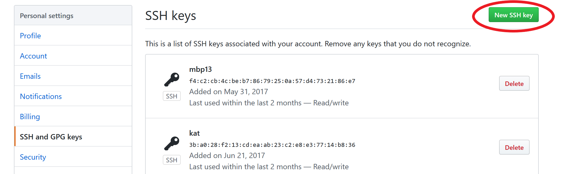
    
    Keep the browser on this page, but switch back to your git bash terminal 
    to `cat` your public key file:
    
        serge@DESKTOP-FA80SDI MINGW64 /c/Users/serge/Documents/courses/pbpl204w19/gittutorial (master)
        $ cd ~/.ssh
        
        serge@DESKTOP-FA80SDI MINGW64 /c/Users/serge/.ssh
        $ ls
        agent.env  config  id_rsa  id_rsa.pub  known_hosts
        
        serge@DESKTOP-FA80SDI MINGW64 /c/Users/serge/.ssh
        $ cat id_rsa.pub
        ssh-rsa AAAAB3NzaC1yc2EAAAADAQABAAACAQC9k0FShs+mHWc2pQIEzp9mWIZJ7ipi+4pF8Ur5063VdKUOmA/nKnd6ycBkO9KMW5Cu/IX+t2DyoguxZuJ3VC8qlBdOE27CKEoIyj1GKGequf3TbNlGGH4rXkcaj9NQ8Y0yGP5CNhwkZBQWc86dv1/MUcrhAJx/HzNo9ZqoFcE1awLMekJyJqY8+zJaeBMgZw2A4Wc80bDOHFCgjLcrCo97fG4VJ+3pH8tevN77HSjkthVKXc5asfbCKvj1Rscfr7VbUE2toaSvT+FMar7HokIpRHjisdp4ovvMZcuHG2aoufWb5RCEzkj0lKL8TFBQwNhY0thPEO+J3KurYGlO9E+VCV1LPZUc/8HkC8GXm16kRsDgnO4YsoTyIAUXuiYBlTkCFENEvLW2bOrCIpm5xHFB+xyqV7Ks9pcBFMEj0zwKqs9oNWQtLVbitniBAXcEfESCKON0LoA/jiC0TLce+UQIG7wyoXnyNCpfA0iv9g1kSMd/PiwLTvwJl/0NCXD8lGhjIGsue13EYh/gwmfBcNshe1I4vOgCqEeb2/w4U3eZOT97Af7g2PChp0GQWdS+g14KJMyuSwlyPevcQrwytqchecFuo1gSALnZQWUOaVqM8KBW6QintFHZR/XLfCaheGH6FOoqW4mj4eoZTUkZICUYreZxD85VU7GgY5m5vIDe3w== sjsrey@gmail.com
    
    We want to copy the output of the `cat` command by dragging the mouse beginning
    with `ssh-rsa AAA.....` and ending with your email, ensuring that all is
    highlighted. Then right click and select copy to put this into the clipboard.
    
    Now return to your browser and select `New SSH key`
    
    
    
    which will bring up the form:
    
    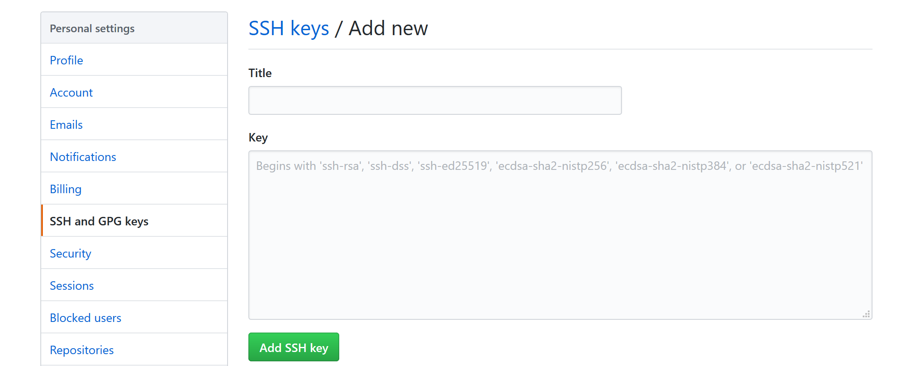
    
    Give the key a name in the `Title` entry and paste the contents of the
    clipboard into the `Key` entry:
    
    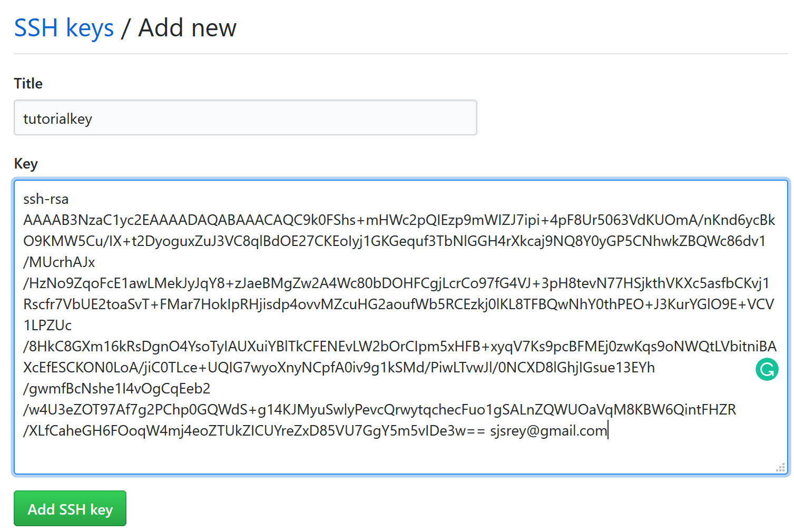
    
    Then click `Add key`. (You may have to enter your github account password at
    this point).

3.  Configuring ssh-agent

    The last piece of the puzzle to configure authentication on the remote is to
    setup our local bash environment to start an agent each time we create a new
    bash terminal. This way we only have to add our passphrase at the start of the
    session, rather than each time we interact with a remote.
    
    To do this create a file in your home directory (remember `cd` will get us back
    to home). You can create the file `.profile` in `spyder` or `Notepad++` but its contents
    should be:
    
        env=~/.ssh/agent.env
        
        agent_load_env () { test -f "$env" && . "$env" >| /dev/null ; }
        
        agent_start () {
            (umask 077; ssh-agent >| "$env")
            . "$env" >| /dev/null ; }
        
        agent_load_env
        
        # agent_run_state: 0=agent running w/ key; 1=agent w/o key; 2= agent not running
        agent_run_state=$(ssh-add -l >| /dev/null 2>&1; echo $?)
        
        if [ ! "$SSH_AUTH_SOCK" ] || [ $agent_run_state = 2 ]; then
            agent_start
            ssh-add
        elif [ "$SSH_AUTH_SOCK" ] && [ $agent_run_state = 1 ]; then
            ssh-add
        fi
        unset env
    
    For example, on my machine I have:
    
        serge@DESKTOP-FA80SDI MINGW64 /c/Users/serge/.ssh
        $ cd
        
        serge@DESKTOP-FA80SDI MINGW64 /c/Users/serge
        $ cat .profile
        env=~/.ssh/agent.env
        
        agent_load_env () { test -f "$env" && . "$env" >| /dev/null ; }
        
        agent_start () {
            (umask 077; ssh-agent >| "$env")
            . "$env" >| /dev/null ; }
        
        agent_load_env
        
        # agent_run_state: 0=agent running w/ key; 1=agent w/o key; 2= agent not running
        agent_run_state=$(ssh-add -l >| /dev/null 2>&1; echo $?)
        
        if [ ! "$SSH_AUTH_SOCK" ] || [ $agent_run_state = 2 ]; then
            agent_start
            ssh-add
        elif [ "$SSH_AUTH_SOCK" ] && [ $agent_run_state = 1 ]; then
            ssh-add
        fi
        
        unset env
        
        serge@DESKTOP-FA80SDI MINGW64 /c/Users/serge
        $
    
    To have this take effect, you will need to close your git bash window and
    restart a new one.
    
    Now, if we restart a shell we should be prompted for our passphrase:
    
    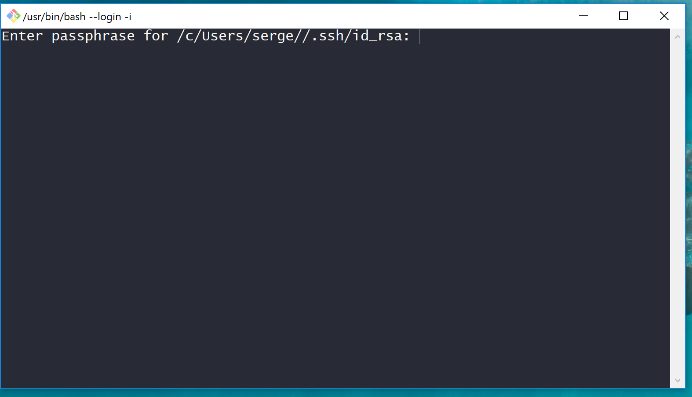
    
    Entering our passphrase correctly will add our identity to the session and we
    will no longer be asked for our passphrase when connecting to a remote (until
    we reboot the machine):
    
    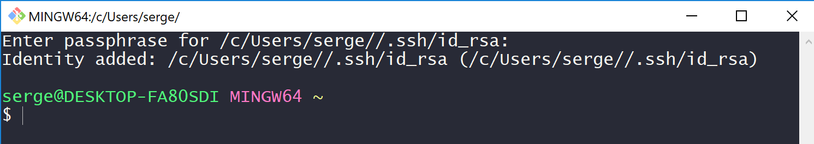
    
    Further Reading: [auto launching agent on git bash](https://help.github.com/en/articles/working-with-ssh-key-passphrases#auto-launching-ssh-agent-on-git-for-windows)
    
    On a Mac, there are a few additional steps to take if these instructions here
    do not work. See [the mac specific instructions on github.](<https://help.github.com/en/articles/generating-a-new-ssh-key-and-adding-it-to-the-ssh-agent#adding-your-ssh-key-to-the-ssh-agent>)

### Creating a remote repository

We are set to connect to a remote, so let's create our own on github for the
purposes of this tutorial. On your github account click the dropdown next to
your profile and select `New Repository`:

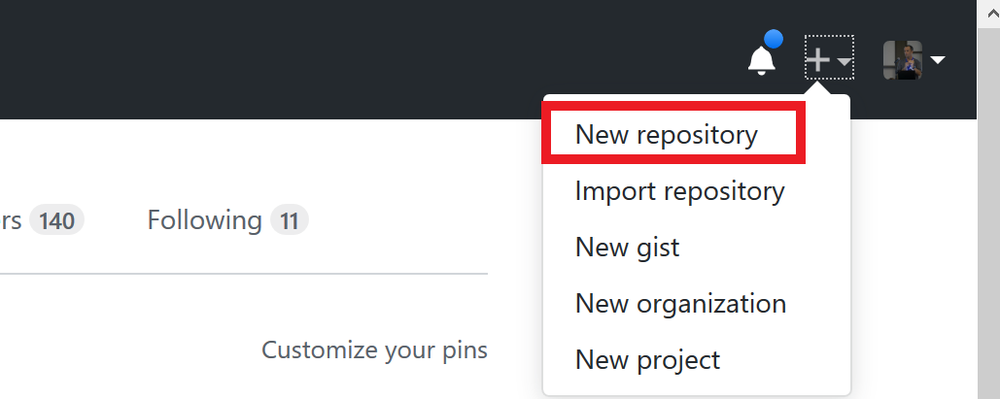

This will bring up a new dialog. We will name the repository `gittest` and make
it `private` so only you can see it. We could make it public but since this is
early days we might not want to share our files:

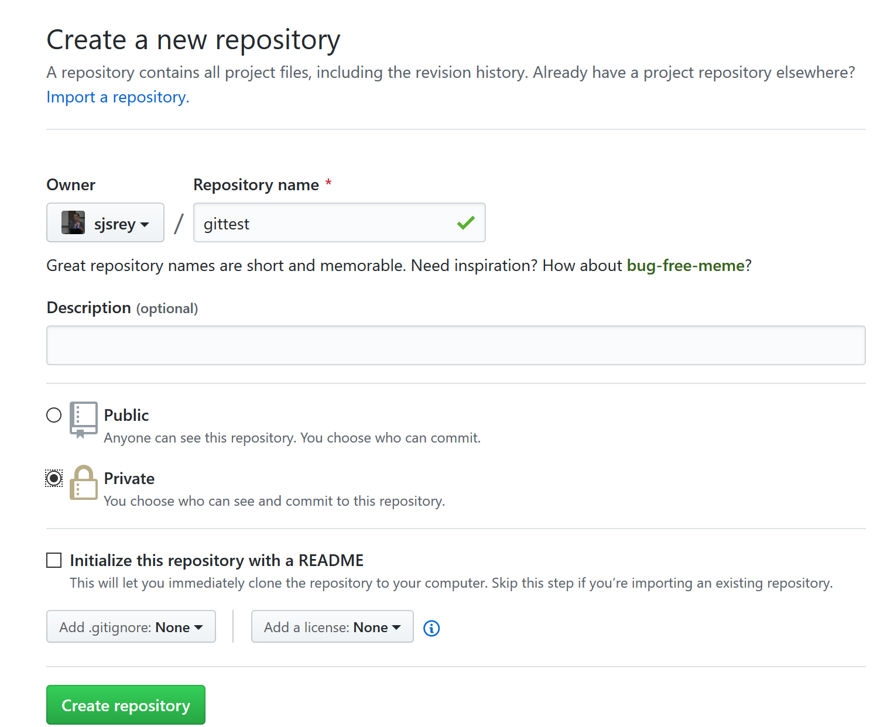

Once you are happy, select `Create repository` and this will bring up
instructions on options for interacting with this new repository:

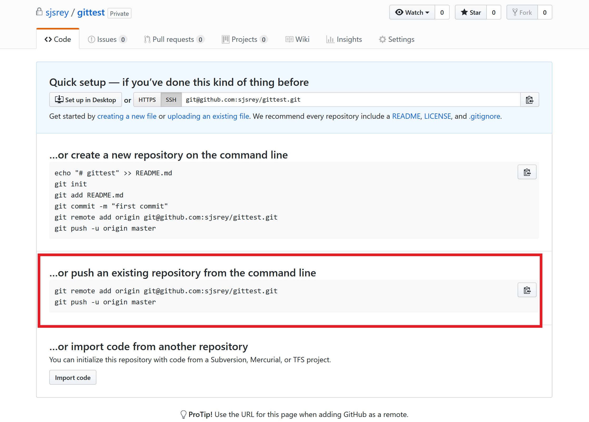

We have already created our *local respository* so we want to follow the second
set of instructions to get our work up to the remote.

First, we add a remote to our local repository so git knows about it (make
sure you are in the repository directory):

    $ ls
    README.md
    
    serge@DESKTOP-FA80SDI MINGW64 /c/Users/serge/Documents/courses/pbpl204w19/gittutorial (master)
    $ git status
    On branch master
    nothing to commit, working tree clean
    
    serge@DESKTOP-FA80SDI MINGW64 /c/Users/serge/Documents/courses/pbpl204w19/gittutorial (master)
    $ git remote add origin git@github.com:sjsrey/gittest.git
    
    serge@DESKTOP-FA80SDI MINGW64 /c/Users/serge/Documents/courses/pbpl204w19/gittutorial (master)
    $ git remote -v
    origin  git@github.com:sjsrey/gittest.git (fetch)
    origin  git@github.com:sjsrey/gittest.git (push)

Next, we push our changes up to this remote:

    $ git push -u origin master
    Enumerating objects: 6, done.
    Counting objects: 100% (6/6), done.
    Delta compression using up to 8 threads
    Compressing objects: 100% (4/4), done.
    Writing objects: 100% (6/6), 545 bytes | 109.00 KiB/s, done.
    Total 6 (delta 1), reused 0 (delta 0)
    remote: Resolving deltas: 100% (1/1), done.
    To github.com:sjsrey/gittest.git
     * [new branch]      master -> master
    Branch 'master' set up to track remote branch 'master' from 'origin'.
    
    serge@DESKTOP-FA80SDI MINGW64 /c/Users/serge/Documents/courses/pbpl204w19/gittutorial (master)

Congratulations, you have just pushed to your first remote!

To see the results of your work, go back to github and click the `gittest`
repos name at the top of the file:

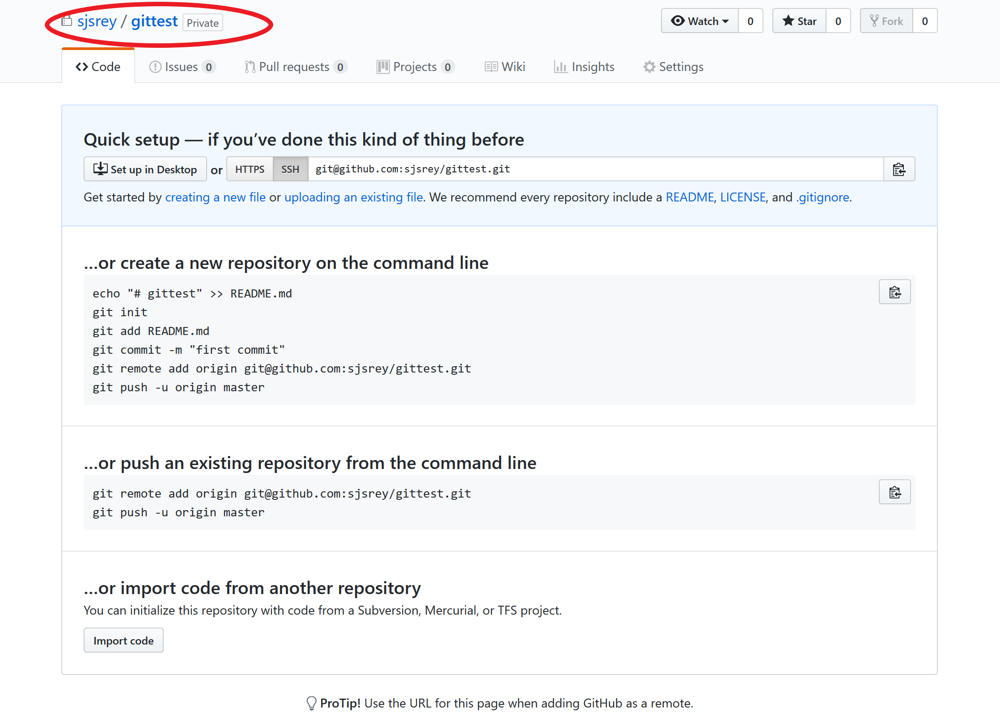

This gets you to the home page on github for your repository:

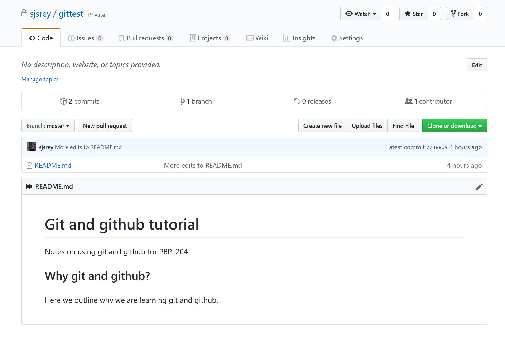

Select the `Commits` link:

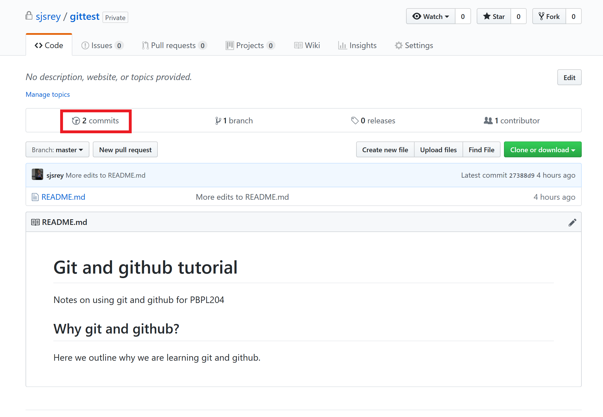

and you will see the commits that we made locally. This all gets pushed up to
the remote so your entire history will be saved both locally and remotely.

We can explore individual commits by clicking on the "hash":

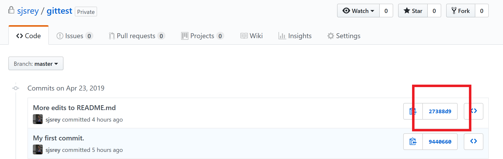

This shows us a side-by-side comparison of the file involved in this commit,
left is before the commit, right is after the commit. Green indicates stuff was added:

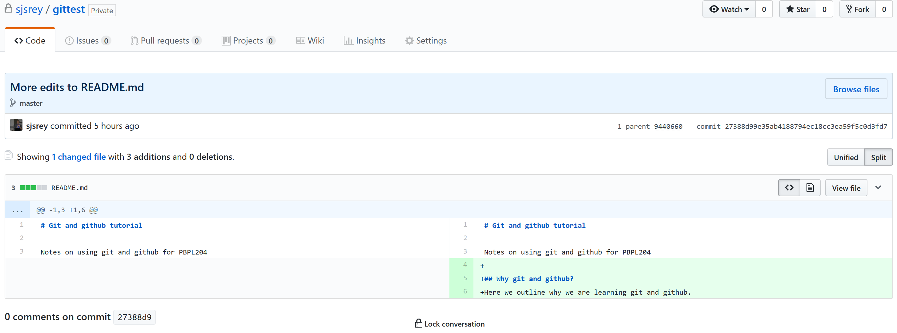

### Getting changes from a remote repository

We can actually edit files remotely on github, although this is generally not
the most efficient way to do things.  But, we will do so here to see how you
can pull down changes from a remote repository to keep you local repository up
to date. This is the way collaborative work happens on github.

Go back to the github landing page for your new repository and click the pencil
icon for the README.md file:

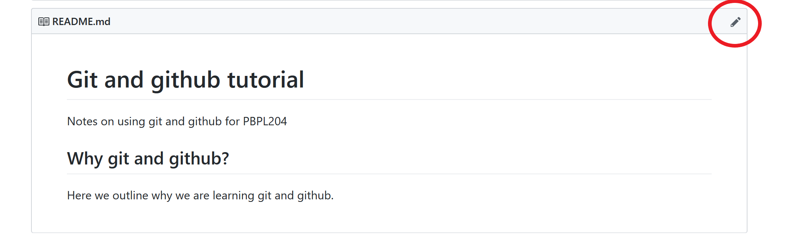

Then edit the file to add some changes:

You can add a commit message at the bottom of the form and then click `Commit
Changes`.

So these changes are now committed on the remote, but we want to get them
locally.

Go to your bash shell and pull the changes down:

    $ git pull origin master
    remote: Enumerating objects: 5, done.
    remote: Counting objects: 100% (5/5), done.
    remote: Compressing objects: 100% (2/2), done.
    remote: Total 3 (delta 1), reused 0 (delta 0), pack-reused 0
    Unpacking objects: 100% (3/3), done.
    From github.com:sjsrey/gittest
     * branch            master     -> FETCH_HEAD
       27388d9..3ffdbc2  master     -> origin/master
    Updating 27388d9..3ffdbc2
    Fast-forward
     README.md | 4 ++++
     1 file changed, 4 insertions(+)
    
    serge@DESKTOP-FA80SDI MINGW64 /c/Users/serge/Documents/courses/pbpl204w19/gittutorial (master)

We see a message that the README.md file has changed. If we `cat` it we can see
the changes locally:

    $ cat README.md
    # Git and github tutorial
    
    Notes on using git and github for PBPL204
    
    ## Why git and github?
    Here we outline why we are learning git and github.
    
    
    ## Adding changes
    Here we added a change on github (i.e., our remote repository).

