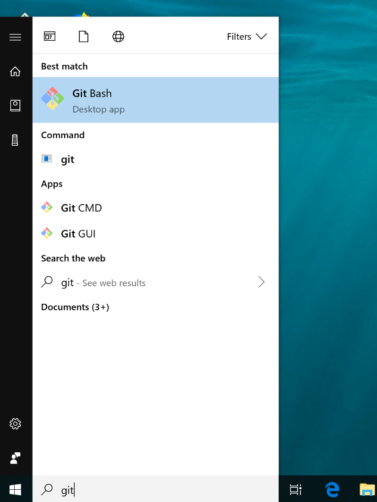
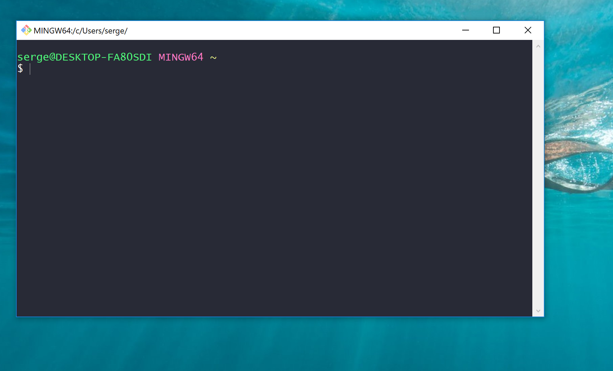
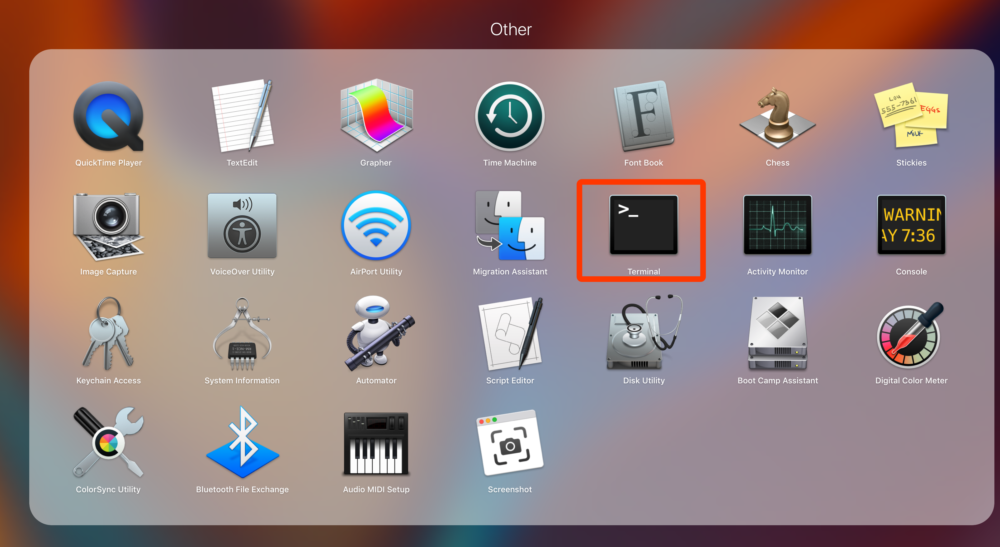
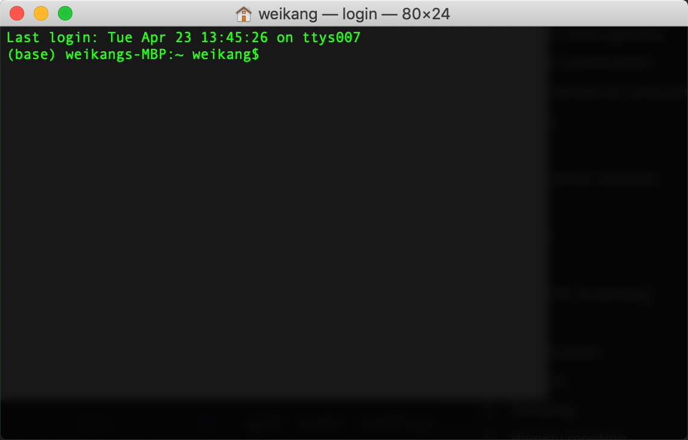
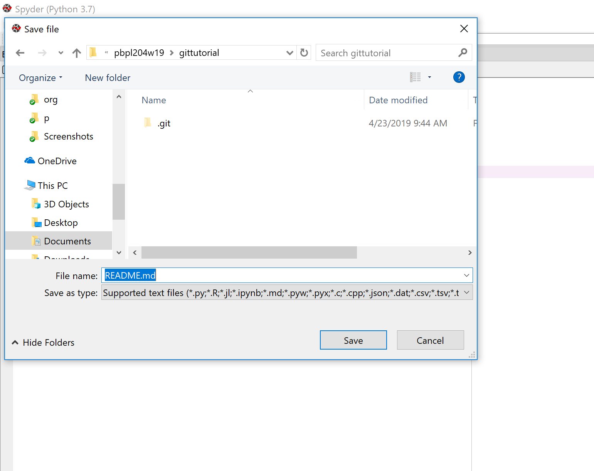
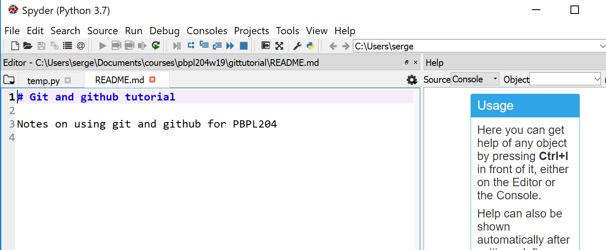
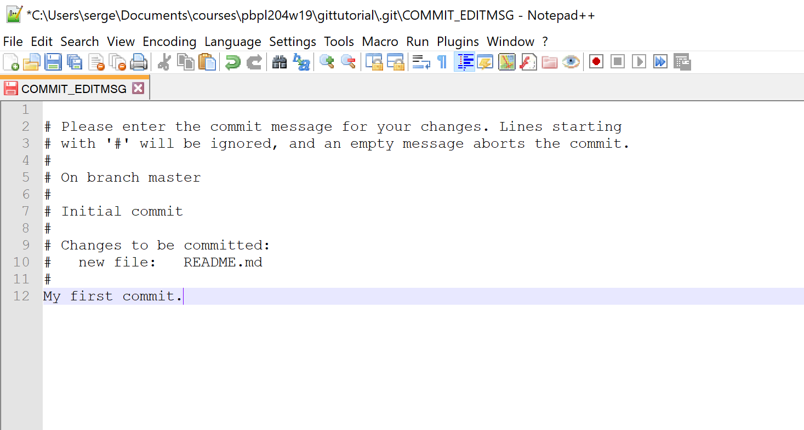

# Table of Contents

1.  [Setup](#org4d37f10)
    1.  [Git bash cli](#orgb410853)
        1.  [Windows](#org1ada8d2)
        2.  [Mac](#org2a875c4)
        3.  [Terminal commands](#orgd613446)
2.  [Repositories](#org48bb7b6)
    1.  [Initializing a local git repository](#orgaefd3a9)
    2.  [Status](#orgc838cc5)
    3.  [Adding a file](#org481a681)
    4.  [Commiting](#org23f697e)
    5.  [Local](#org097c928)
    6.  [Remotes](#org396a913)
        1.  [Setting up remote authentication](#orga39f28d)
        2.  [mac](#org4410f6e)
        3.  [Push a local to a new remote](#org8845c65)
        4.  [Fork](#org00d0eee)
        5.  [Cloning](#orged44ac0)

# Setup

## Git bash cli

We will rely on the command line interface (CLI) to work with git. While this may
seem arcane at first, relative to a more famililar point-and-click interface,
using the command line will have major payoffs for the initial investment. The
key benefits of the cli over a graphical client are:

-   efficiency
-   flexibility
-   portability

We are going to use git-bash as our CLI client on Windows. We then will setup a cli
for Mac after configuring Windows. 

### Windows

1.  Configuration

    We follow instructions from the
    [Git book](https://git-scm.com/book/en/v2/Getting-Started-First-Time-Git-Setup)
    
    1.  Start git bash
    
        
        
        This should open up the console with a git bash shell:
        
        
    
    2.  git user config file is:
    
        `C:\Users\$USER\.gitconfig`
        
        where `$USER` is the user name (i.e., serge)
    
    3.  In git bash:
    
            serge@DESKTOP-FA80SDI MINGW64 ~
            $ cat .gitconfig
            [user]
                    name = Serge Rey
                    email = sjsrey@gmail.com
        
        This was after I setup my config with:
        
            $ git config --global user.name "Serge Rey"
            $ git config --global user.email sjsrey@gmail.com
    
    4.  Editor: Notepad ++
    
        [download and install 32-bit version](https://notepad-plus-plus.org/)
        used only for git commit messages
        
        Setup for git commit messages:
        
            git config --global core.editor "'C:/Program Files (x86)/Notepad++/notepad++.exe' -multiInst -nosession"
        
        After this check, check your settings:
        
            $ pwd
            /c/Users/serge/
            
            serge@DESKTOP-FA80SDI MINGW64 ~
            $ cat .gitconfig
            [user]
                    name = Serge Rey
                    email = sjsrey@gmail.com
            [core]
                    editor = 'C:/Program Files (x86)/Notepad++/notepad++.exe' -multiInst -nosession
            
            serge@DESKTOP-FA80SDI MINGW64 ~
        
        Or use git itself to check specific settings:
        
            serge@DESKTOP-FA80SDI MINGW64 ~
            $ git config user.name
            Serge Rey
            
            serge@DESKTOP-FA80SDI MINGW64 ~
            $ git config user.email
            sjsrey@gmail.com

### Mac

1.  Configuration

    1.  Start Mac CLI: [Terminal app](https://support.apple.com/guide/terminal/welcome/mac)
    
        
        
        This should open up the console with a git bash shell:
        
        
    
    2.  git user config file is:
    
        `/Users/$USER/.gitconfig`
        
        where `$USER` is the user name (i.e., weikang)
    
    3.  In git bash:
    
            weikangs-MBP:~ weikang
            $ cat .gitconfig
            [user]
                    name = weikang9009
                    email = weikang9009@gmail.com
        
        This was after I setup my config with:
        
            $ git config --global user.name "weikang9009"
            $ git config --global user.email weikang9009@gmail.com
    
    4.  Editor for git commit messages: Visual Studio (VS) Code

        (You can also use other editors like [atom](https://flight-manual.atom.io/using-atom/sections/version-control-in-atom/))
    
        1. [download and install VS Code on macOS](https://code.visualstudio.com/Download)

        2. Enable VS Code to run from the terminal by typing 'code': 

            1. Launch VS Code.
            
            2. Open the Command Palette (`Shift+Command+P`) and type 'shell command' to find the Shell Command: Install 'code' command in PATH command.
            
            

            3. Restart the terminal for the new $PATH value to take effect. You'll be able to type `code .` in any folder to start editing files in that folder.
   
        3. Setup for git commit messages in the terminal:
          
            $ git config --global core.editor "code --wait"
        
        4. After this check, check your settings:
        
                $ pwd
                /Users/weikang
            
                $ cat .gitconfig
                [user]
                        name = weikang9009
                        email = weikang9009@gmail.com
                [core]
                        editor = code --wait

### Terminal commands

Once we have the command line client setup, we are at a bash prompt on either
Windows or Mac, and the commands will all be the same (with the exception of
the editor if we are using one to create the git commit messages-more below).

Some common bash commands to become familiar with include:

1.  finding out current directory: `pwd`

        serge@DESKTOP-FA80SDI MINGW64 ~
        $ pwd
        /c/Users/serge/
        
        serge@DESKTOP-FA80SDI MINGW64 ~

2.  listing contents of current director: `ls`

        serge@DESKTOP-FA80SDI MINGW64 ~
        $ ls
        '3D Objects'/
         Anaconda3/
         AppData/
        'Application Data'@
         Contacts/
         Cookies@
         Desktop/
         Documents/
         Downloads/
         Dropbox/
         Favorites/
         Links/
        'Local Settings'@
         MicrosoftEdgeBackups/
         Music/
        'My Documents'@
         NetHood@

3.  moving to a directory: `cd`

        serge@DESKTOP-FA80SDI MINGW64 ~
        $ cd Documents/
        
        serge@DESKTOP-FA80SDI MINGW64 /c/Users/serge/Documents
        $ pwd
        /c/Users/serge/Documents
        
        serge@DESKTOP-FA80SDI MINGW64 /c/Users/serge/Documents
    
    Note that `cd` without an argument will take you back to your home directory.
    
    Also note that `clear` will clear the terminal.

4.  making a directory: `mkdir`

    We will create a directory for our course work.
    
        serge@DESKTOP-FA80SDI MINGW64 /c/Users/serge/Documents
        $ mkdir courses
        
        serge@DESKTOP-FA80SDI MINGW64 /c/Users/serge/Documents
        $ ls
         ArcGIS/                                       courses/       'My Videos'@
        'ArcGIS 10.5.1'/                               desktop.ini     p/
        'ArcGIS Pro 2.2'/                             'My Music'@
         ArcGISDesktopAdvanced_SingleUse_690779.prvc  'My Pictures'@
        
        serge@DESKTOP-FA80SDI MINGW64 /c/Users/serge/Documents
        $ cd courses
        
        serge@DESKTOP-FA80SDI MINGW64 /c/Users/serge/Documents/courses
        $ pwd
        /c/Users/serge/Documents/courses
        
        serge@DESKTOP-FA80SDI MINGW64 /c/Users/serge/Documents/courses
        $ mkdir pbpl204w19
        
        serge@DESKTOP-FA80SDI MINGW64 /c/Users/serge/Documents/courses
        $ ls
        pbpl204w19/
        
        serge@DESKTOP-FA80SDI MINGW64 /c/Users/serge/Documents/courses
        $

5.  Shell tips

    There are a number of handy features in the shell that can save us time.
    
    1.  History
    
        Using the up arrow key, we can recall the history of things we have done to
        recall a command we want to repeat (or edit). Each time we up-arrow we go back
        in the history one step. If you are on the command you want, you can hit
        `Enter` to execute that command. If you overshoot with the up arrow key, use
        the down arrow key to go in the other direction.
        
        You can also use the `history` command to get a listing of what you have done:
        
             242  cd git_tutorial/
              243  ls
              244  git status
              245  git remote -v
              246  git pull origin master
              247  ssh -v snuc
              248  emacs -nw
              249  exit
              250  pwd
              251  ls
              252  clear
              253  ls
              254  cd Documents/
              255  pwd
              256  ls
              257  cd courses/
              258  ls
              259  rmdir -f pbpl204s19/
              260  rm -f pbpl204s19/
              261  rm -fr pbpl204s19/
              262  ls
              263  clear
              264  cd ..
              265  clear
              266  rm -rf courses
              267  clear
              268  ls
              269  mkdir courses/pbpl204s19
              270  clear
              271  mkdir courses
              272  ls
              273  cd courses
              274  pwd
              275  mkdir pbpl204w19
              276  ls
              277  history
            
            serge@DESKTOP-FA80SDI MINGW64 /c/Users/serge/Documents/courses
            $
        
        So `history` was the last thing I did. If I want to use `pwd`, for example, I
        can use `!274` and `Enter` to repeat the command:
        
              274  pwd
              275  mkdir pbpl204w19
              276  ls
              277  history
            
            serge@DESKTOP-FA80SDI MINGW64 /c/Users/serge/Documents/courses
            $ !274
            pwd
            /c/Users/serge/Documents/courses
            
            serge@DESKTOP-FA80SDI MINGW64 /c/Users/serge/Documents/courses
            $
    
    2.  Tab completion
    
        We can also make use of the `Tab` key to save us some typing. We have
        previously created the directory `pbpl204w19` but haven't yet changed into it
        as we are currently in its parent folder. We could get into that directory
        using `cd pbpl204w19` but that is too much typing. Instead use `cd pb<TAB>`
        where `<TAB>` means use the tab key to complete the typing:
        
            serge@DESKTOP-FA80SDI MINGW64 /c/Users/serge/Documents/courses
            $ cd pbpl204w19/
        
        Then `Enter`:
        
            $ cd pbpl204w19/
            
            serge@DESKTOP-FA80SDI MINGW64 /c/Users/serge/Documents/courses/pbpl204w19
            $ pwd
            /c/Users/serge/Documents/courses/pbpl204w19
            
            serge@DESKTOP-FA80SDI MINGW64 /c/Users/serge/Documents/courses/pbpl204w19
            $

# Repositories

Next we will set up a git repository in our new directory. Repositories are
where the files for our project will reside, and where git keeps track of the
history of all files in the project.

Let us create a new directory for our project (good practice is to have one git
repository for each project, rather than one repository to hold many projects).

    serge@DESKTOP-FA80SDI MINGW64 /c/Users/serge/Documents/courses/pbpl204w19
    $ mkdir gittutorial
    
    serge@DESKTOP-FA80SDI MINGW64 /c/Users/serge/Documents/courses/pbpl204w19
    $ cd gittutorial/
    
    serge@DESKTOP-FA80SDI MINGW64 /c/Users/serge/Documents/courses/pbpl204w19/gittutorial

## Initializing a local git repository

So far we have a new directory, but not a respository. We will initialize the
repository with `git init`

    serge@DESKTOP-FA80SDI MINGW64 /c/Users/serge/Documents/courses/pbpl204w19/gittutorial
    $ git init
    Initialized empty Git repository in C:/Users/serge/Documents/courses/pbpl204w19/gittutorial/.git/

The directory `.git` is where all the bookkeeping is done by git. We need not
go in there, but it is good to know what it is.

## Status

Anytime we want to see what the status of our repository is we use `git status`:

    $ git status
    On branch master
    
    No commits yet
    
    nothing to commit (create/copy files and use "git add" to track)

This tells us we are on the `branch` called `master`. More on branches later,
but for now, you can think of a branch as a version of the project repository.

The other output from the `status` command is that we have nothing to commit so
we may want to add files to our project.

## Adding a file

First we need to create a file, then add it to the repository.

Open up `spyder` and create a file *in this directory* called `README.md`.

Then edit the file to have the first line be:

    # Git and github tutorial
    
    Notes on using git and github for PBPL204

so that your editor should look something like:

Now that file is a simple text file that uses [Markdown](<https://github.com/adam-p/markdown-here/wiki/Markdown-Cheatsheet>) syntax that is
rendered on github nicely (and used to build webpages everywhere).

If we check the status of our repository now:

    $ git status
    On branch master
    
    No commits yet
    
    Untracked files:
      (use "git add <file>..." to include in what will be committed)
    
            README.md
    
    nothing added to commit but untracked files present (use "git add" to track)

we see that the new file `README.md` shows up under *Untracked files*. This
means it is not tracked by the repository, but rather is in the folder where
the other files in our repository reside. 

We can add the file to our repository with `git add`:

    serge@DESKTOP-FA80SDI MINGW64 /c/Users/serge/Documents/courses/pbpl204w19/gittutorial (master)
    $ git add README.md
    
    serge@DESKTOP-FA80SDI MINGW64 /c/Users/serge/Documents/courses/pbpl204w19/gittutorial (master)

Now check the status again:

    $ git status
    On branch master
    
    No commits yet
    
    Changes to be committed:
      (use "git rm --cached <file>..." to unstage)
    
            new file:   README.md
    
    
    serge@DESKTOP-FA80SDI MINGW64 /c/Users/serge/Documents/courses/pbpl204w19/gittutorial (master)

and we see the file `README.md` has changes that can be committed. This means
the file is now being tracked by git (since we just added it).
Technically speaking, the file has been *stagged* and is ready for *commiting*.
The stagging area holds changes we have made to a file in the respository, but
those changes have not yet been commited to the repository.
The stage allows us to make a bunch of changes to a file before we do a commit.

## Commiting

We now are in a position to commit our changes in the file to the respository.
We use `git commit` for this:

    serge@DESKTOP-FA80SDI MINGW64 /c/Users/serge/Documents/courses/pbpl204w19/gittutorial (master)
    $ git commit

which should bring up Notepadd++ that we configured above to edit our commit
message. Below the lines beginning with `#` add a commit message so your editor
looks like:

Save the file (`<CTRL-s>`) and quit notepad++ and you should see:

    serge@DESKTOP-FA80SDI MINGW64 /c/Users/serge/Documents/courses/pbpl204w19/gittutorial (master)
    $ git commit
    [master (root-commit) 9440660] My first commit.
     1 file changed, 3 insertions(+)
     create mode 100644 README.md
    
    serge@DESKTOP-FA80SDI MINGW64 /c/Users/serge/Documents/courses/pbpl204w19/gittutorial (master)
    $

Recheck the status of the repository:

    serge@DESKTOP-FA80SDI MINGW64 /c/Users/serge/Documents/courses/pbpl204w19/gittutorial (master)
    $ git status
    On branch master
    nothing to commit, working tree clean
    
    serge@DESKTOP-FA80SDI MINGW64 /c/Users/serge/Documents/courses/pbpl204w19/gittutorial (master)
    $

So we have nothing to commit, and our working tree is clean. All good.

We can get a look at what git knows about our respository using `git log`:

    $ git log
    commit 94406606f5b2f20a0abf290a0b916308aa4ac0e2 (HEAD -> master)
    Author: Serge Rey <sjsrey@gmail.com>
    Date:   Tue Apr 23 10:14:29 2019 -0700
    
        My first commit.
    
    serge@DESKTOP-FA80SDI MINGW64 /c/Users/serge/Documents/courses/pbpl204w19/gittutorial (master)
    $

Note that our commit message `My first commit` shows up in the log. So it is
good practice to write meaningful commit messages as they can help you remember
the purpose of the changes you made at that point in the project.

## Local

-   create a local repository
-   git init
-   edit a file README.md
-   git status
-   demonstrate git add
-   demonstrate git commit
-   using the editor
-   git status
-   

-   fire up spyder
-   create a file saving to the same directory as the repository
-   git status
-   edit in spyder to develop
-   git bash for interfacing with git

## Remotes

### Setting up remote authentication

[ssh keys](https://git-scm.com/book/en/v2/Git-on-the-Server-Generating-Your-SSH-Public-Key#_generate_ssh_key)

[auto launching agent on git bash](https://help.github.com/en/articles/working-with-ssh-key-passphrases#auto-launching-ssh-agent-on-git-for-windows)

### mac

[agent](https://help.github.com/en/articles/generating-a-new-ssh-key-and-adding-it-to-the-ssh-agent#adding-your-ssh-key-to-the-ssh-agent)

### Push a local to a new remote

-   create a remote on github
-   see instructions about pushing a local repositor
-   cut and paste instructions
-   git remote -v
-   git push -u origin master
-   checkout remote repos
-   

-   make a change on the web site
-   git status

### Fork

### Cloning

